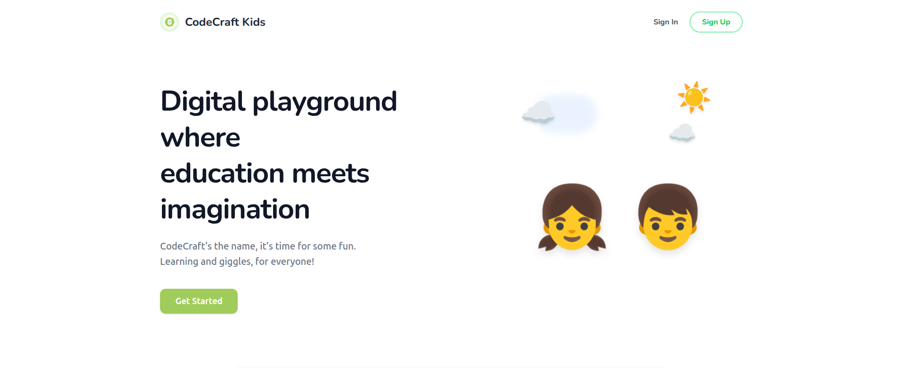

# CodeCraft Kids: The Next Generation of Python Education



[](https://github.com/rid-coder-70/CodeCraft-Kids)
[](https://github.com/rid-coder-70/CodeCraft-Kids)
[](https://github.com/rid-coder-70/CodeCraft-Kids)

Welcome to **CodeCraft Kids**, a premiere, gamified Learning Management System (LMS) designed to turn coding from a daunting task into a world-class adventure. We focus on creating a high-end, minimalist environment that fosters creativity and focuses the mind.

---

## 🌟 What's New in v3.0

The latest version of CodeCraft Kids introduces a completely modern, high-performance architecture:

*   **Real-Time Platform Metrics**: A live stats engine on the Hero page that displays actual user counts and calculates a real-time "Average Age" from our community.
*   **Premium Visual Experience**: Fully integrated handwritten typography system with custom font fallback logic for a playful, professional brand identity.
*   **Inline Dashboard Architecture**: A single-page experience (SPA) where Profile Settings, Pro Mode Simulators, and Level Pickers work seamlessly without page reloads.
*   **Advanced Iconography**: 100% vector-based iconography using `react-icons/fa`, replacing all legacy emojis with professional SVG assets.

---

## Detailed Documentation

Explore the specialized documentation for different parts of the platform:
- [Frontend (Client) Documentation](client/README.md)
- [Backend (Server) Documentation](Server/README.md)
- [Production Deployment Guide](DEPLOY.md)

---

## Core Educational Features

*   **Python Island Quest**: A sequential, level-locked curriculum that guides students through Python fundamentals with clear milestones.
*   **Python Lab (v3.0)**: A professional, kid-friendly code editor featuring real-time Syntax Highlighting and a high-performance Skulpt browser console.
*   **Adventure Shop**: An interactive marketplace where students spend earned Coding Gems on avatar customizations and magical treasures (UI Integrated).
*   **Daily Streaks**: A sophisticated engagement engine (Duolingo-style) that tracks and rewards consecutive days of coding.
*   **Community Feed**: A moderated social layer where students share achievements, exchange coding tips, and celebrate progress through likes and comments.
*   **Automated Certification**: Real-time badge awarding and milestone tracking through our proprietary progress engine.

---

## Integrated Technology Stack

| Layer | Technologies | Key Capabilities |
| :--- | :--- | :--- |
| **Frontend** | React 19, Vite, Tailwind CSS, Framer Motion | High-performance, 60fps animations, mobile-first design. |
| **Backend** | Node.js, Express 5, Mongoose | Secured RESTful API, high-concurrency request handling. |
| **Database** | MongoDB (NoSQL) | Flexible, document-oriented storage for student progress. |
| **Security** | JWT, Bcrypt, Multer | Industrial-grade session management and encrypted storage. |
| **Execution** | Skulpt Library | Safe, client-side Python 3 execution without server latency. |

---

## Engineering Setup Guide

### 1. Prerequisites
*   Node.js (v18.0.0 or higher)
*   MongoDB (Local instance or Cloud Atlas cluster)

### 2. Rapid Installation

```bash
# Clone the repository
git clone https://github.com/rid-coder-70/CodeCraft-Kids
cd CodeCraft-Kids

# Initialize Backend Environment
cd Server
npm install
cp .env.example .env    # Configure your MONGODB_URI and JWT_SECRET

# Initialize Frontend Environment
cd ../client
npm install
```

### 3. Local Execution

Open two terminal windows:

**Terminal 1 (Backend):**
```bash
cd Server && npm run dev    # Listens on Port 5000
```

**Terminal 2 (Frontend):**
```bash
cd client && npm run dev    # Listens on Port 5173
```

---

## 👥 Meet the Team

We are a group of passionate developers dedicated to making coding education fun and accessible for kids everywhere.

*   **Ridoy Baidya** ([@rid-coder-70](https://github.com/rid-coder-70)) - Lead Developer & Backend Engineer
*   **Priom Chakraborty** ([@chkpriom](https://github.com/chkpriom)) - Frontend Engineer & Game Logic Designer
*   **Rahat Ahmed** - ([@rahatfarabi](https://github.com/rahatfarabi)) Frontend Developer & UI/UX Designer

---

## Contributing & Community
We welcome contributions to the CodeCraft Kids project! Whether it's adding new coding levels, improving the Python Lab, or refining the Adventure Shop, your help makes a difference.

1.  Fork the Project
2.  Create your Feature Branch (`git checkout -b feature/AmazingFeature`)
3.  Commit your Changes (`git commit -m 'Add some AmazingFeature'`)
4.  Push to the Branch (`git push origin feature/AmazingFeature`)
5.  Open a Pull Request

---
*Created for the future engineers of the world!*
